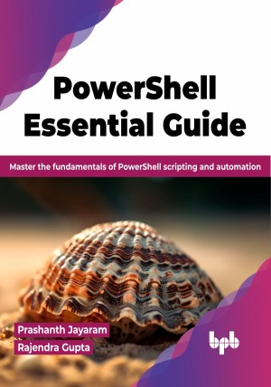

# PowerShell Essential Guide

PowerShell Essentials - Your path to efficient automation and scripting

This is the repository for [PowerShell Essential Guide
](https://bpbonline.com/products/powershell-essential-guide?variant=43054718877896),published by BPB Publications.

## About the Book
In the last decade, PowerShell has propelled in every way in the automation arena. Since the inception of PowerShell, it has become a de facto tool for automation, and it is the favorite solution of many Windows administrators, with the capability to automate almost any task in the Microsoft ecosystem. Since the advent of PowerShell, it has been a lot easier to import the related modules and invoke the associated cmdlets call to take care of many day-to-day mundane activities, from simple to complex maintenance.

Beginning with introductory chapters that cover Azure concepts, an overview of PowerShell, and other related tools, the reader will be introduced to the advanced concepts of Azure components without heavy emphasis on Cloud. This book would give an IT administrator's view of Microsoft Azure by equipping them to construct, manage, and administer workloads on-premise or in the Cloud. The later chapters are straightforward to understand and completely isolated from each section. For every section, the PowerShell code is designed, and readers with no prior experience can jump into the topics and get started with the examples.

The aim of this book is to provide the reader with hands-on experience with Azure databases, enabling them to work with what is relevant in the market today and is clearly in the future. It would be great to have hands-on experience with PowerShell; this would help you to progress faster. However, if you have experience with PowerShell, you can jump to a specific chapter or topic in the book. 

## What You Will Learn
• Get to understand the Windows operating system as PowerShell is a cross-platform scripting language, so understand how it works on multi-platforms.

• Learn to use PowerShell for administration, such as on the Cloud, Active Directory, VMware and SQL Server, and more.

•  Learn to administer infrastructure effectively.

•  Practice real-world examples to ensure proficiency.
